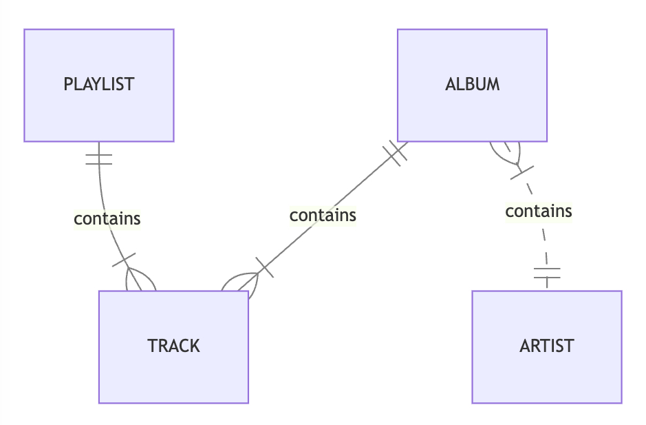

!!! warning
    For an RDBMS, you can create a normalized data model without thinking about access patterns. You can then extend it later when new questions and query requirements arise. By contrast, in Amazon DynamoDB, you shouldn't start designing your schema until you know the questions that it needs to answer. Understanding the business problems and the application use cases up front is absolutely essential.

## DynamoDB Approach

As explained in the [project overview](../index.md), DynamoDB approaches data modeling differently from relational databases. 

### Access Patterns

In each DynamoDB table, data is organized for locality of expected access patterns.
This gives you excellent performance if the structure of the data and access patterns agree 
and terrible performance otherwise.
 
To design a DynamoDB table that scales efficiently, you must first identify the access patterns required by the business logic.

Suppose we are building a music library with this entity model.



This music library needs to support the following access patterns.

<table>
  <tbody>
    <tr>
      <th colspan=2 align="center">The Most Common Access Patterns</th>
    </tr>
    <tr>
      <td>1</td>
      <td>Load album and its tracks by album token</td>
    </tr>
    <tr>
      <td>2</td>
      <td>Load track by track token</td>
    </tr>
    <tr>
      <td>3</td>
      <td>List tracks in a playlist</td>
    </tr>
    <tr>
      <td>4</td>
      <td>List albums by artist name</td>
    </tr>
    <tr>
      <td>5</td>
      <td>Find album by album title</td>
    </tr>     
    <tr>
      <td>6</td>
      <td>Find track by track title</td>
    </tr>     
    <tr>
      <td colspan=2>...</td>
    </tr>    
  </tbody>
</table>


### Efficient Schema

An efficient schema that keeps related data in close proximity has a major impact on cost and performance. 
Instead of distributing related data items across multiple tables, you should keep related items in your table as close together as possible.
Typically, this means storing related rows in the same table, and with the same partition key.
Within a partition key, related rows should share a prefix of the sort key.

We can design an efficient schema using these patterns:
  
* **Denormalization**: Schema flexibility lets DynamoDB store structured data, such as lists, sets, and nested objects, in a single item.
* **Composite key aggregation**: Deliberate key design puts related entities close together.
* **Sort order**: Related items can be grouped together and queried efficiently if their key design causes them to sort together.
* **Global secondary indexes**: By creating specific global secondary indexes, you can enable different queries than your main table can support, and that are still fast and inexpensive.
* **Adjacency list**: [Adjacency lists](https://docs.aws.amazon.com/amazondynamodb/latest/developerguide/bp-adjacency-graphs.html) are a design pattern that is useful for modeling many-to-many relationships. More generally, they provide a way to represent graph data (nodes and edges).
              

<table>
  <tbody>
    <tr>
      <td colspan=2 align="center">Primary Key</td>
      <td rowspan=2 colspan=4 align="center" valign="top">Attributes</td>
    </tr>
    <tr>
      <td><strong>partition_key</strong></td>
      <td><strong>sort_key</strong></td>
    </tr>
    <tr>
      <td rowspan=2 style="vertical-align:bottom;" valign="bottom">ALBUM_1</td>
      <td rowspan=2 style="vertical-align:bottom;" valign="bottom">INFO</td>
      <td><strong>album_title</strong></td>
      <td><strong>album_artist</strong></td>
      <td><strong>release_date</strong></td>
      <td><strong>genre</strong></td>
    </tr>
    <tr>
      <td>The Dark Side of the Moon</td>
      <td>Pink Floyd</td>
      <td>1973-03-01</td>
      <td>Progressive rock</td>
    </tr>
    <tr>
      <td rowspan=2 style="vertical-align:bottom;" valign="bottom">ALBUM_1</td>
      <td rowspan=2 style="vertical-align:bottom;" valign="bottom">TRACK_1</td>
      <td><strong>track_title</strong></td>
      <td><strong>run_length</strong></td>
      <td>&nbsp;</td>
      <td>&nbsp;</td>
    </tr>
    <tr>
      <td>Speak to Me</td>
      <td>PT1M13S</td>
      <td>&nbsp;</td>
      <td>&nbsp;</td>
    </tr>
    <tr>
      <td rowspan=2 style="vertical-align:bottom;" valign="bottom">ALBUM_1</td>
      <td rowspan=2 style="vertical-align:bottom;" valign="bottom">TRACK_2</td>
      <td><strong>track_title</strong></td>
      <td><strong>run_length</strong></td>
      <td>&nbsp;</td>
      <td>&nbsp;</td>
    </tr>
    <tr>
      <td>Breathe</td>
      <td>PT2M43S</td>
      <td>&nbsp;</td>
      <td>&nbsp;</td>
    </tr>
    <tr>
      <td rowspan=2 style="vertical-align:bottom;" valign="bottom">ALBUM_1</td>
      <td rowspan=2 style="vertical-align:bottom;" valign="bottom">TRACK_3</td>
      <td><strong>track_title</strong></td>
      <td><strong>run_length</strong></td>
      <td>&nbsp;</td>
      <td>&nbsp;</td>
    </tr>
    <tr>
      <td>On the Run</td>
      <td>PT3M36S</td>
      <td>&nbsp;</td>
      <td>&nbsp;</td>
    </tr>
    <tr>
      <td colspan=6>...</td>
    </tr>
    <tr>
      <td rowspan=2 style="vertical-align:bottom;" valign="bottom">ALBUM_2</td>
      <td rowspan=2 style="vertical-align:bottom;" valign="bottom">INFO</td>
      <td><strong>album_title</strong></td>
      <td><strong>album_artist</strong></td>
      <td><strong>release_date</strong></td>
      <td><strong>genre</strong></td>
    </tr>
    <tr>
      <td>The Wall</td>
      <td>Pink Floyd</td>
      <td>1979-11-30</td>
      <td>Progressive rock</td>
    </tr>
    <tr>
      <td rowspan=2 style="vertical-align:bottom;" valign="bottom">ALBUM_2</td>
      <td rowspan=2 style="vertical-align:bottom;" valign="bottom">TRACK_1</td>
      <td><strong>track_title</strong></td>
      <td><strong>run_length</strong></td>
      <td>&nbsp;</td>
      <td>&nbsp;</td>
    </tr>
    <tr>
      <td>In the Flesh?</td>
      <td>PT3M20S</td>
      <td>&nbsp;</td>
      <td>&nbsp;</td>
    </tr>
    <tr>
      <td colspan=6>...</td>
    </tr>
    <tr>
      <td rowspan=2 style="vertical-align:bottom;" valign="bottom">PLAYLIST_1</td>
      <td rowspan=2 style="vertical-align:bottom;" valign="bottom">INFO</td>
      <td><strong>playlist_name</strong></td>
      <td><strong>playlist_size</strong></td>
      <td><strong>playlist_tracks</strong></td>
      <td><strong>playlist_version</strong></td>
    </tr>
    <tr>
      <td>Psychedelic Rock Essentials</td>
      <td>100</td>
      <td>ALBUM_1/TRACK_1, ALBUM_1322/TRACK_9, ALBUM_3423/TRACK_3, ALBUM_84/TRACK_10, ALBUM_2/TRACK_5, <br/>...</td>
      <td>12</td>
    </tr>
    <tr>
      <td colspan=6>...</td>
    </tr>
  </tbody>
</table>

This table uses a [composite primary key](https://aws.amazon.com/blogs/database/choosing-the-right-dynamodb-partition-key/), `(parition_key, sort_key)`, to identify each item.

* The key `("ALBUM_1", "INFO")` identifies `ALBUM_1`'s metadata.
* The key `("ALBUM_1", "TRACK_1")` identifies `ALBUM_1`'s first track.
* The key `("PLAYLIST_1", "INFO")` identifies `PLAYLIST_1`'s content.

It uses secondary indexes to answer additional queries.

<table>
  <tbody>
    <tr>
      <td colspan=2 align="center">GSI Primary Key</td>
      <td rowspan=2 colspan=4 align="center" valign="top">Projected Attributes</td>
    </tr>
    <tr>
      <td><strong>artist_name</strong></td>
      <td><strong>partition_key</strong></td>
    </tr>
    <tr>
      <td rowspan=2 style="vertical-align:bottom;" valign="bottom">Pink Floyd</td>
      <td rowspan=2 style="vertical-align:bottom;" valign="bottom">ALBUM_1</td>
      <td><strong>album_title</strong></td>
      <td><strong>sort_key</strong></td>
      <td><strong>release_date</strong></td>
      <td><strong>genre</strong></td>
    </tr>
    <tr>
      <td>The Dark Side of the Moon</td>
      <td>INFO</td>
      <td>1973-03-01</td>
      <td>Progressive rock</td>
    </tr>
    <tr>
      <td rowspan=2 style="vertical-align:bottom;" valign="bottom">Pink Floyd</td>
      <td rowspan=2 style="vertical-align:bottom;" valign="bottom">ALBUM_2</td>
      <td><strong>album_title</strong></td>
      <td><strong>sort_key</strong></td>
      <td><strong>release_date</strong></td>
      <td><strong>genre</strong></td>
    </tr>
    <tr>
      <td>The Wall</td>
      <td>INFO</td>
      <td>1979-11-30</td>
      <td>Progressive rock</td>
    </tr>   
    <tr>
      <td colspan=6>...</td>
    </tr>
    <tr>
      <td rowspan=2 style="vertical-align:bottom;" valign="bottom">The Beatles</td>
      <td rowspan=2 style="vertical-align:bottom;" valign="bottom">ALBUM_232</td>
      <td><strong>album_title</strong></td>
      <td><strong>sort_key</strong></td>
      <td><strong>release_date</strong></td>
      <td><strong>genre</strong></td>
    </tr>
    <tr>
      <td>Revolver</td>
      <td>INFO</td>
      <td>1966-06-21</td>
      <td>Rock</td>
    </tr>   
    <tr>
      <td colspan=6>...</td>
    </tr>
  </tbody>
</table>

This [global secondary index](https://docs.aws.amazon.com/amazondynamodb/latest/developerguide/GSI.html) groups `AlbumInfo` by `artist_name` and sorts them by the primary index `parition_key`. 

## Tempest

Tempest lets you define strongly typed data models on top of your [`DynamoDBMapper`](https://docs.aws.amazon.com/amazondynamodb/latest/developerguide/DynamoDBMapper.html) classes.

=== "Kotlin - SDK 2.x: 

    ```kotlin
    interface MusicDb : LogicalDb {
       @TableName("music_items")
       val music: MusicTable
    }
    
    interface MusicTable : LogicalTable<MusicItem> {
      val albumInfo: InlineView<AlbumInfo.Key, AlbumInfo>
      val albumTracks: InlineView<AlbumTrack.Key, AlbumTrack>
    
      val playlistInfo: InlineView<PlaylistInfo.Key, PlaylistInfo>
    
      // Global Secondary Indexes.
      val albumInfoByGenre: SecondaryIndex<AlbumInfo.GenreIndexOffset, AlbumInfo>
      val albumInfoByArtist: SecondaryIndex<AlbumInfo.ArtistIndexOffset, AlbumInfo>
    
      // Local Secondary Indexes.
      val albumTracksByTitle: SecondaryIndex<AlbumTrack.TitleIndexOffset, AlbumTrack>
    }
    
    @DynamoDbBean
    class MusicItem {
      // Primary key.
      @get:DynamoDbPartitionKey
      @get:DynamoDbSecondarySortKey(indexNames = ["genre_album_index", "artist_album_index"])
      var partition_key: String? = null
      @get:DynamoDbSortKey
      var sort_key: String? = null
      // Attributes...
    }
    ```

=== "Java - SDK 2.x: 

    ```java
    public interface MusicDb extends LogicalDb {
      @TableName("music_items")
      MusicTable music();
    }
    
    public interface MusicTable extends LogicalTable<MusicItem> {
      InlineView<AlbumInfo.Key, AlbumInfo> albumInfo();
      InlineView<AlbumTrack.Key, AlbumTrack> albumTracks();
    
      InlineView<PlaylistInfo.Key, PlaylistInfo> playlistInfo();
    
      // Global Secondary Indexes.
      SecondaryIndex<AlbumInfo.GenreIndexOffset, AlbumInfo> albumInfoByGenre();
      SecondaryIndex<AlbumInfo.ArtistIndexOffset, AlbumInfo> albumInfoByArtist();
    
      // Local Secondary Indexes.
      SecondaryIndex<AlbumTrack.TitleIndexOffset, AlbumTrack> albumTracksByTitle();
    }
    
    @DynamoDbBean
    public class MusicItem {
      // All Items.
      String partition_key = null;
      String sort_key = null;
      // Attributes...

      @DynamoDbAttribute("partition_key")
      @DynamoDbPartitionKey
      @DynamoDbSecondarySortKey(indexNames = {"genre_album_index", "artist_album_index"})
      public String getPartitionKey() {
        return partition_key;
      }
    
      public void setPartitionKey(String partition_key) {
        this.partition_key = partition_key;
      }
    
      @DynamoDbAttribute("sort_key")
      @DynamoDbSortKey
      public String getSortKey() {
        return sort_key;
      }
    
      public void setSortKey(String sort_key) {
        this.sort_key = sort_key;
      }
      // Getters and setters...
    }
    ```

=== "Kotlin - SDK 1.x: 

    ```kotlin
    interface MusicDb : LogicalDb {
      val music: MusicTable
    }
    
    interface MusicTable : LogicalTable<MusicItem> {
      val albumInfo: InlineView<AlbumInfo.Key, AlbumInfo>
      val albumTracks: InlineView<AlbumTrack.Key, AlbumTrack>
    
      val playlistInfo: InlineView<PlaylistInfo.Key, PlaylistInfo>
    
      // Global Secondary Indexes.
      val albumInfoByGenre: SecondaryIndex<AlbumInfo.GenreIndexOffset, AlbumInfo>
      val albumInfoByArtist: SecondaryIndex<AlbumInfo.ArtistIndexOffset, AlbumInfo>
    
      // Local Secondary Indexes.
      val albumTracksByTitle: SecondaryIndex<AlbumTrack.TitleIndexOffset, AlbumTrack>
    }
    
    @DynamoDBTable(tableName = "music_items")
    class MusicItem {
      // Primary key.
      @DynamoDBHashKey
      @DynamoDBIndexRangeKey(globalSecondaryIndexNames = ["genre_album_index", "artist_album_index"])
      var partition_key: String? = null
      @DynamoDBRangeKey
      var sort_key: String? = null
      // Attributes...
    }
    ```

=== "Java - SDK 1.x: 

    ```java
    public interface MusicDb extends LogicalDb {
      MusicTable music();
    }
    
    public interface MusicTable extends LogicalTable<MusicItem> {
      InlineView<AlbumInfo.Key, AlbumInfo> albumInfo();
      InlineView<AlbumTrack.Key, AlbumTrack> albumTracks();
    
      InlineView<PlaylistInfo.Key, PlaylistInfo> playlistInfo();
    
      // Global Secondary Indexes.
      SecondaryIndex<AlbumInfo.GenreIndexOffset, AlbumInfo> albumInfoByGenre();
      SecondaryIndex<AlbumInfo.ArtistIndexOffset, AlbumInfo> albumInfoByArtist();
    
      // Local Secondary Indexes.
      SecondaryIndex<AlbumTrack.TitleIndexOffset, AlbumTrack> albumTracksByTitle();
    }
    
    @DynamoDBTable(tableName = "music_items")
    public class MusicItem {
      // All Items.
      String partition_key = null;
      String sort_key = null;
      // Attributes...
      
      @DynamoDBHashKey(attributeName = "partition_key")
      @DynamoDBIndexRangeKey(globalSecondaryIndexNames = {"genre_album_index", "artist_album_index"})
      public String getPartitionKey() {
        return partition_key;
      }
    
      public void setPartitionKey(String partition_key) {
        this.partition_key = partition_key;
      }
    
      @DynamoDBRangeKey(attributeName = "sort_key")
      public String getSortKey() {
        return sort_key;
      }
    
      public void setSortKey(String sort_key) {
        this.sort_key = sort_key;
      }
      // Getter and setters...
    }
    ```

Tempest has these components:

* Logical DB
    * Logical tables (1 to 1 with your DynamoDBMapper classes)
        * Inline views 
            * Key type
            * Item type
        * Secondary indexes 
            * Offset type
            * Item type

### Logical DB
A `LogicalDb` is a collection of tables that implement the DynamoDB best practice of putting multiple
item types into the same storage table. This makes it possible to perform aggregate operations
and transactions on those item types.

For example, you can batch load up to 100 items in a single request. 

=== "Kotlin: 

    ```kotlin
    val items = musicDb.batchLoad(
      AlbumTrack.Key("ALBUM_1", "TRACK_5"),
      AlbumTrack.Key("ALBUM_2", "TRACK_3"),
      PlaylistInfo.Key("PLAYLIST_1"))
    ```

=== "Java: 

    ```java
    ItemSet items = db.batchLoad(
        List.of(
            new AlbumTrack.Key("ALBUM_1", "TRACK_5"),
            new AlbumTrack.Key("ALBUM_2", "TRACK_3"),
            new PlaylistInfo.Key("PLAYLIST_1")));
    ```

To create a `LogicalDb`, you need to pass in an instance of `DynamoDBMapper`.

=== "Kotlin - SDK 2.x: 
    
    ```kotlin
    val enhancedClient = DynamoDbEnhancedClient.create()
    val db: MusicDb = LogicalDb(enhancedClient)
    ```

=== "Java - SDK 2.x: 

    ```java
    DynamoDbEnhancedClient enhancedClient = DynamoDbEnhancedClient.create();
    MusicDb db = LogicalDb.create(MusicDb.class, enhancedClient);
    ```

=== "Kotlin - SDK 1.x: 
    
    ```kotlin
    val client: AmazonDynamoDB = AmazonDynamoDBClientBuilder.standard().build()
    val mapper: DynamoDBMapper = DynamoDBMapper(client)
    val db: MusicDb = LogicalDb(mapper)
    ```

=== "Java - SDK 1.x: 

    ```java
    AmazonDynamoDB client = AmazonDynamoDBClientBuilder.standard().build();
    DynamoDBMapper mapper = new DynamoDBMapper(client);
    MusicDb db = LogicalDb.create(MusicDb.class, mapper);
    ```

#### Optional Configuration

When you create an instance of DynamoDBMapper, it has certain default behaviors; you can override these defaults by using the DynamoDBMapperConfig class.

The following code snippet creates a DynamoDBMapper with custom settings:

=== "Kotlin - SDK 2.x: 

    ```kotlin
    val client = DynamoDbClient.create()
    val enhancedClient = DynamoDbEnhancedClient.builder()
      .dynamoDbClient(client)
      .extensions(listOf(/* ... */))
      .build()
    val db: MusicDb = LogicalDb(enhancedClient)
    ```

=== "Java - SDK 2.x: 
    
    ```java
    DynamoDbClient client = DynamoDbClient.create();
    DynamoDbEnhancedClient enhancedClient = DynamoDbEnhancedClient.builder()
        .dynamoDbClient(client)
        .extensions(List.of(/* ... */))
        .build();
    MusicDb db = LogicalDb.create(MusicDb.class, enhancedClient);
    ```
    
=== "Kotlin - SDK 1.x: 

    ```kotlin
    val client = AmazonDynamoDBClientBuilder.standard().build()
    val mapperConfig = DynamoDBMapperConfig.builder()
      .withSaveBehavior(SaveBehavior.CLOBBER)
      .withConsistentReads(ConsistentReads.CONSISTENT)
      .withTableNameOverride(null)
      .withPaginationLoadingStrategy(PaginationLoadingStrategy.EAGER_LOADING)
      .build()
    val mapper = DynamoDBMapper(client, mapperConfig)
    val db: MusicDb = LogicalDb(mapper)
    ```

=== "Java - SDK 1.x: 
    
    ```java
    AmazonDynamoDB client = AmazonDynamoDBClientBuilder.standard().build();
    DynamoDBMapperConfig mapperConfig = DynamoDBMapperConfig.builder()
        .withSaveBehavior(DynamoDBMapperConfig.SaveBehavior.CLOBBER)
        .withConsistentReads(DynamoDBMapperConfig.ConsistentReads.CONSISTENT)
        .withTableNameOverride(null)
        .withPaginationLoadingStrategy(DynamoDBMapperConfig.PaginationLoadingStrategy.EAGER_LOADING)
      .build();
    DynamoDBMapper mapper = new DynamoDBMapper(client, mapperConfig);
    MusicDb db = LogicalDb.create(MusicDb.class, mapper);
    ```
    
For more information, see the [DynamoDBMapper documentation](https://docs.aws.amazon.com/amazondynamodb/latest/developerguide/DynamoDBMapper.OptionalConfig.html)

### Logical Table

A `LogicalTable` is a collection of views on a DynamoDB table that makes it easy to model heterogeneous items using strongly typed data classes.

#### Inline View 

An `InlineView` lets you perform CRUD operations, queries, and scans on an entity type.

=== "Kotlin: 

    ```kotlin
    interface MusicTable : LogicalTable<MusicItem> {
      val albumInfo: InlineView<AlbumInfo.Key, AlbumInfo>
    }
    
    data class AlbumInfo(
      @Attribute(name = "partition_key")
      val album_token: String,
      val album_title: String,
      val artist_name: String,
      val release_date: LocalDate,
      val genre_name: String
    ) {
      @Attribute(prefix = "INFO_")
      val sort_key: String = ""
      
      data class Key(
        val album_token: String
      ) {
        val sort_key: String = ""
      }
    }
    ```

=== "Java: 

    ```kotlin
    public interface MusicTable extends LogicalTable<MusicItem> {
      InlineView<AlbumInfo.Key, AlbumInfo> albumInfo();
    }
    
    public class AlbumInfo {
      @Attribute(name = "partition_key")
      public final String album_token;
      public final String album_title;
      public final String artist_name;
      public final LocalDate release_date;
      public final String genre_name;
    
      @Attribute(prefix = "INFO_")
      public final String sort_key = "";
    
      public AlbumInfo(
          String album_token,
          String album_title, 
          String artist_name,
          LocalDate release_date,
          String genre_name) {
        this.album_token = album_token;
        this.album_title = album_title;
        this.artist_name = artist_name;
        this.release_date = release_date;
        this.genre_name = genre_name;
      }
    
      public static class Key {
        public final String album_token;
        public final String sort_key = "";
    
        public Key(String album_token) {
          this.album_token = album_token;
        }
      }
    }
    ```
    
The `albumInfo` view is a type-safe way to access `AlbumInfo` entities:

<table>
  <tbody>
    <tr>
      <td colspan=2 align="center">Primary Key</td>
      <td rowspan=2 colspan=4 align="center" valign="top">Attributes</td>
    </tr>
    <tr>
      <td><strong>partition_key</strong></td>
      <td><strong>sort_key</strong></td>
    </tr>
    <tr>
      <td rowspan=2 style="vertical-align:bottom;" valign="bottom">ALBUM_1</td>
      <td rowspan=2 style="vertical-align:bottom;" valign="bottom">INFO</td>
      <td><strong>album_title</strong></td>
      <td><strong>album_artist</strong></td>
      <td><strong>release_date</strong></td>
      <td><strong>genre</strong></td>
    </tr>
    <tr>
      <td>The Dark Side of the Moon</td>
      <td>Pink Floyd</td>
      <td>1973-03-01</td>
      <td>Progressive rock</td>
    </tr>
    <tr>
      <td colspan=6>...</td>
    </tr>
    <tr>
      <td rowspan=2 style="vertical-align:bottom;" valign="bottom">ALBUM_2</td>
      <td rowspan=2 style="vertical-align:bottom;" valign="bottom">INFO</td>
      <td><strong>album_title</strong></td>
      <td><strong>album_artist</strong></td>
      <td><strong>release_date</strong></td>
      <td><strong>genre</strong></td>
    </tr>
    <tr>
      <td>The Wall</td>
      <td>Pink Floyd</td>
      <td>1979-11-30</td>
      <td>Progressive rock</td>
    </tr>
    <tr>
      <td colspan=6>...</td>
    </tr>
  </tbody>
</table>

!!! important "Prefixes are 1:1 with Types" 
    A `LogicalTable` can have multiple `InlineView`s. Tempest requires you to declare a prefix on the sort key in each entity type.
    It uses the prefix to determine the entity type.
    
    | Prefix    | Type       |
    | :---------| :--------- |
    | INFO_     | AlbumInfo  |
    | TRACK_    | AlbumTrack |
    
=== "Kotlin: 

    ```kotlin
    interface MusicTable : LogicalTable<MusicItem> {
      val albumInfo: InlineView<AlbumInfo.Key, AlbumInfo>
      val albumTracks: InlineView<AlbumTrack.Key, AlbumTrack>
    }
    
    data class AlbumInfo(
      @Attribute(name = "partition_key")
      val album_token: String,
      // ...
    ) {
      @Attribute(prefix = "INFO_")
      val sort_key: String = ""
    }
    
    data class AlbumTrack(
      @Attribute(name = "partition_key")
      val album_token: String,
      @Attribute(name = "sort_key", prefix = "TRACK_")
      val track_token: String,
      // ...
    )
    ```

=== "Java: 

    ```java
    public interface MusicTable extends LogicalTable<MusicItem> {
      InlineView<AlbumInfo.Key, AlbumInfo> albumInfo();
      InlineView<AlbumTrack.Key, AlbumTrack> albumTracks();
    }
    
    public class AlbumInfo {
      @Attribute(name = "partition_key")
      public final String album_token;
      // ...
      @Attribute(prefix = "INFO_")
      public final String sort_key = "";
      // ...
    }
    
    public class AlbumTrack {
      @Attribute(name = "partition_key")
      public final String album_token;
      @Attribute(name = "sort_key", prefix = "TRACK_")
      public final String track_token;
      // ...
    }
    ```

#### Secondary Index

An `SecondaryIndex` lets you perform queries, and scans on an entity type.

=== "Kotlin: 

    ```kotlin
    interface MusicTable : LogicalTable<MusicItem> {
      val albumInfoByArtist: SecondaryIndex<AlbumInfo.ArtistIndexOffset, AlbumInfo>
    }
    
    data class AlbumInfo(
      @Attribute(name = "partition_key")
      val album_token: String,
      val album_title: String,
      val artist_name: String,
      val release_date: LocalDate,
      val genre_name: String
    ) {
      @Attribute(prefix = "INFO_")
      val sort_key: String = ""
    
      @ForIndex("artist_album_index")
      data class ArtistIndexOffset(
        val artist_name: String,
        val album_token: String? = null,
        // To uniquely identify an item in pagination.
        val sort_key: String? = null
      )
    }
    ```
    
=== "Java: 

    ```java
    public interface MusicTable extends LogicalTable<MusicItem> {
      SecondaryIndex<AlbumInfo.ArtistIndexOffset, AlbumInfo> albumInfoByArtist();
    }
    
    public class AlbumInfo {
      @Attribute(name = "partition_key")
      public final String album_token;
      public final String album_title;
      public final String artist_name;
      public final LocalDate release_date;
      public final String genre_name;
    
      @Attribute(prefix = "INFO_")
      public final String sort_key = "";
    
      @ForIndex(name = "artist_album_index")
      public static class ArtistIndexOffset {
        public final String artist_name;
        @Nullable
        public final String album_token;
        // To uniquely identify an item in pagination.
        @Nullable
        public final String sort_key;
    
        public ArtistIndexOffset(String artist_name) {
          this(artist_name, null, null);
        }
    
        public ArtistIndexOffset(String artist_name, String album_token) {
          this(artist_name, album_token, null);
        }
    
        public ArtistIndexOffset(String artist_name, @Nullable String album_token,
            @Nullable String sort_key) {
          this.artist_name = artist_name;
          this.album_token = album_token;
          this.sort_key = sort_key;
        }
      }
    }
    ```

DynamoDB secondary indexes allows duplicate values.
In order to uniquely identify an item in pagination, a secondary index offset type needs
to include the primary index partition key and sort key in addition to the secondary index partition key and sort key.  

Secondary index offset types are also required to have a `@ForIndex` annotation that tells Tempest the index name.

!!! important "Properties are always mapped by name" 
    Our secondary index data class properties have the exact same name as the properties in our
    DynamoDB mapper class. Tempest uses name equality to bind indexes, keys, and items to the
    DynamoDB mapper class. Each Tempest type represents a different logical subset of the available
    attributes.
    
The mapper class is just the union of the fields in each item, key, and secondary index.

|MusicItem    |AlbumInfo.Key |AlbumInfo.ArtistIndexOffset|AlbumInfo    |AlbumTrack.Key|AlbumTrack   |
|-------------|-------------|-----------------------|-------------|-------------|-------------|
|partition_key|partition_key|partition_key          |partition_key|partition_key|partition_key|
|sort_key     |sort_key     |sort_key               |sort_key     |sort_key     |sort_key     |    
|album_title  |             |                       |album_title  |             |             |
|artist_name  |             |artist_name            |artist_name  |             |             |
|release_date |             |                       |release_date |             |             |
|genre        |             |                       |genre        |             |             |
|track_title  |             |                       |             |             |track_title  |
|run_length   |             |                       |             |             |run_length   |

#### Custom Attribute Types

Tempest uses `DynamoDBMapper` to encode and decode entities.

`DynamoDBMapper` supports [these primitive Java types](https://docs.aws.amazon.com/amazondynamodb/latest/developerguide/DynamoDBMapper.DataTypes.html). 

You may use `DynamoDBTypeConverter` to support [custom attribute types](https://docs.aws.amazon.com/amazondynamodb/latest/developerguide/DynamoDBMapper.ArbitraryDataMapping.html).

=== "Kotlin - SDK 2.x: 

    ```kotlin
    @DynamoDbBean
    class MusicItem {
      // ...
      @get:DynamoDbAttribute
      @get:DynamoDbConvertedBy(LocalDateTypeConverter::class)
      var release_date: LocalDate? = null
      // ...
    }

    internal class LocalDateTypeConverter : AttributeConverter<LocalDate> {
      override fun transformFrom(input: LocalDate): AttributeValue {
        return AttributeValue.builder().s(input.toString()).build()
      }
    
      override fun transformTo(input: AttributeValue): LocalDate {
        return LocalDate.parse(input.s())
      }
    
      override fun type(): EnhancedType<LocalDate> {
        return EnhancedType.of(LocalDate::class.java)
      }
    
      override fun attributeValueType(): AttributeValueType {
        return AttributeValueType.S
      }
    }
    ```

=== "Java - SDK 2.x: 

    ```java
    @DynamoDbBean
    public class MusicItem {
      // ...
      @DynamoDbAttribute("release_date")
      @DynamoDbConvertedBy(LocalDateTypeConverter.class)
      public String getReleaseDate() {
        return release_date;
      }
      // ...
    }

    class LocalDateTypeConverter implements AttributeConverter<LocalDate> {
      @Override public AttributeValue transformFrom(LocalDate input) {
        return AttributeValue.builder().s(input.toString()).build();
      }
    
      @Override public LocalDate transformTo(AttributeValue input) {
        return LocalDate.parse(input.s());
      }
    
      @Override public EnhancedType<LocalDate> type() {
        return EnhancedType.of(LocalDate.class);
      }
    
      @Override public AttributeValueType attributeValueType() {
        return AttributeValueType.S;
      }
    }
    ```

=== "Kotlin - SDK 1.x: 

    ```kotlin
    @DynamoDBTable(tableName = "music_items")
    class MusicItem {
      // ...
      @DynamoDBAttribute
      @DynamoDBTypeConverted(converter = LocalDateTypeConverter::class)
      var release_date: LocalDate? = null
      // ...
    }
    
    class LocalDateTypeConverter : DynamoDBTypeConverter<String, LocalDate> {
      override fun unconvert(string: String): LocalDate {
        return LocalDate.parse(string)
      }
    
      override fun convert(localDate: LocalDate): String {
        return localDate.toString()
      }
    }
    ```

=== "Java - SDK 1.x: 

    ```java
    @DynamoDBTable(tableName = "music_items")
    public class MusicItem {
      // ...
      @DynamoDBAttribute(attributeName = "release_date")
      @DynamoDBTypeConverted(converter = LocalDateTypeConverter.class)
      public LocalDate getReleaseDate() {
        return release_date;
      }
      // ...
    }
    
    class LocalDateTypeConverter implements DynamoDBTypeConverter<String, LocalDate> {
      @Override public String convert(LocalDate object) {
        return object.toString();
      }
    
      @Override public LocalDate unconvert(String object) {
        return LocalDate.parse(object);
      }
    }
    ```
    
---

Check out the code samples on Github:

 * Music Library - SDK 1.x ([.kt](https://github.com/cashapp/tempest/tree/main/samples/musiclibrary/src/main/kotlin/app/cash/tempest/musiclibrary), [.java](https://github.com/cashapp/tempest/tree/main/samples/musiclibrary/src/main/java/app/cash/tempest/musiclibrary/java))
 * Music Library - SDK 2.x ([.kt](https://github.com/cashapp/tempest/tree/main/samples/musiclibrary2/src/main/kotlin/app/cash/tempest2/musiclibrary), [.java](https://github.com/cashapp/tempest/tree/main/samples/musiclibrary2/src/main/java/app/cash/tempest2/musiclibrary/java))
