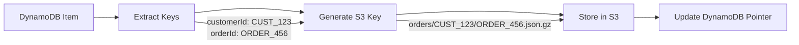
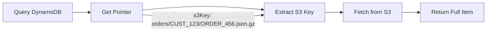

# Deterministic S3 Key Generation

## Design Principle

S3 keys in the hybrid storage system are **deterministic** - they are generated solely from the DynamoDB item's partition and sort keys. This ensures that:

1. **Pointers are reliable**: The S3 key stored in DynamoDB will always point to the correct S3 object
2. **Keys are recreatable**: Given just the DynamoDB keys, we can always regenerate the exact S3 key
3. **No duplicates**: The same item will always map to the same S3 location

## Key Generation Rules

### Template Variables

The S3 key template supports these variables:
- `{tableName}` - The DynamoDB table name
- `{partitionKey}` - The partition key value (sanitized)
- `{sortKey}` - The sort key value (sanitized, empty string if no sort key)

### Default Template

```kotlin
@HybridTable(
    archiveAfterDays = 180,
    s3KeyTemplate = "{tableName}/{partitionKey}/{sortKey}"
)
```

### Examples

#### Single Key Table
```kotlin
// Item with partition key only
Item(userId = "USER_123", data = "...")

// Template: "{tableName}/{partitionKey}"
// Result: "users/USER_123.json.gz"
```

#### Composite Key Table
```kotlin
// Item with partition and sort keys
Item(customerId = "CUST_456", orderId = "ORDER_789", data = "...")

// Template: "{tableName}/{partitionKey}/{sortKey}"
// Result: "orders/CUST_456/ORDER_789.json.gz"
```

## Why NOT Include Timestamps

### ❌ Bad Design (Non-Deterministic)
```kotlin
// DON'T DO THIS
s3KeyTemplate = "orders/{partitionKey}/{sortKey}/{timestamp}"

// Problems:
// 1. Which timestamp? createdAt? archivedAt? now()?
// 2. Format variations: "2024-01-15" vs "20240115" vs "2024-01-15T10:30:45Z"
// 3. Duplicates if archived multiple times
// 4. Can't recreate key from DynamoDB pointer
```

### ✅ Good Design (Deterministic)
```kotlin
// DO THIS
s3KeyTemplate = "orders/{partitionKey}/{sortKey}"

// Benefits:
// 1. Always generates same key for same item
// 2. No duplicates possible
// 3. Can recreate from DynamoDB keys alone
// 4. Simple and predictable
```

## Key Sanitization

Special characters in keys are automatically sanitized:

| Original Character | Replaced With |
|-------------------|---------------|
| `<` `>` `:` `"` `\|` `?` `*` `\\` | `_` |
| Multiple `_` | Single `_` |

Example:
```kotlin
// Original key: "user:123<test>"
// Sanitized: "user_123_test_"
// S3 key: "users/user_123_test_.json.gz"
```

## Archival Flow



## Retrieval Flow



## Testing Determinism

```kotlin
@Test
fun `same keys always generate same S3 key`() {
    val item1 = Order("CUST_123", "ORDER_456", amount = 99.99, time = now())
    val item2 = Order("CUST_123", "ORDER_456", amount = 199.99, time = later())

    val key1 = generateS3Key(item1)
    val key2 = generateS3Key(item2)

    assertEquals(key1, key2)  // Always true - deterministic!
}
```

## Migration from Timestamp-Based Keys

If you have existing data with timestamp-based keys:

1. **Keep old data**: Leave existing S3 objects as-is
2. **Update template**: Remove timestamp variables
3. **Re-archive**: Run archival to create new pointers
4. **Clean up**: Delete old S3 objects after verification

## Best Practices

### DO ✅
- Use only partition and sort keys in templates
- Keep templates simple and readable
- Test key generation with your actual data
- Use S3 metadata for timestamps if needed

### DON'T ❌
- Include timestamps in S3 keys
- Use mutable fields in templates
- Create complex nested structures
- Rely on field values that might change

## S3 Storage Structure

With deterministic keys, your S3 bucket has a clean, predictable structure:

```
s3://my-bucket/
├── orders/
│   ├── CUST_100/
│   │   ├── ORDER_001.json.gz
│   │   ├── ORDER_002.json.gz
│   │   └── ORDER_003.json.gz
│   └── CUST_101/
│       ├── ORDER_004.json.gz
│       └── ORDER_005.json.gz
└── users/
    ├── USER_001.json.gz
    ├── USER_002.json.gz
    └── USER_003.json.gz
```

## Configuration Examples

### E-commerce Orders
```kotlin
@HybridTable(
    archiveAfterDays = 365,
    s3KeyTemplate = "orders/{partitionKey}/{sortKey}"
)
data class Order(
    @DynamoDBHashKey val customerId: String,
    @DynamoDBRangeKey val orderId: String,
    // ...
)
```

### User Profiles
```kotlin
@HybridTable(
    archiveAfterDays = 730,
    s3KeyTemplate = "users/{partitionKey}"
)
data class UserProfile(
    @DynamoDBHashKey val userId: String,
    // ...
)
```

### Time-Series Data
```kotlin
@HybridTable(
    archiveAfterDays = 90,
    s3KeyTemplate = "metrics/{partitionKey}/{sortKey}"
)
data class Metric(
    @DynamoDBHashKey val deviceId: String,
    @DynamoDBRangeKey val timestamp: String,  // Sort key is timestamp
    // ...
)
// S3 key: "metrics/DEVICE_001/2024-01-15T10:00:00Z.json.gz"
// Still deterministic because timestamp is the sort key!
```

## Summary

Deterministic S3 keys ensure:
- **Reliability**: Pointers always work
- **Simplicity**: No complex key management
- **Idempotency**: Re-archiving is safe
- **Testability**: Predictable behavior
- **Maintainability**: Easy to understand and debug

The key insight: **S3 keys are pointers, not descriptions**. They need to be stable identifiers, not rich metadata.